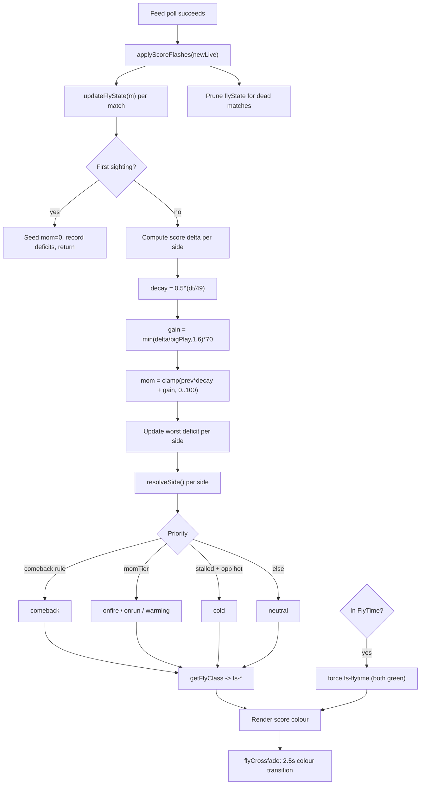

# 01 — Current System Audit (Part 1)

A complete logic map of the FlySense implementation as it exists today. Every behaviour below is cited to [index.html](../../index.html). FlySense is implemented entirely client-side in that single file.

---

## 1. Where the system lives

| Concern | Location in `index.html` |
|---|---|
| Per-sport tuning (`FLY_TUNING`) | ~L1727 |
| Decay / gain constants (`MOM_GAIN`, `MOM_HALFLIFE_SEC`) | ~L1740, ~L1744 |
| State container (`flyState`) | ~L1753 |
| Colour crossfade (`flyFadePrev`, `flyCrossfade`) | ~L1760-1786 |
| Tier mapping (`momTier`) | ~L1788 |
| Momentum update (`updateFlyState`) | ~L2301 |
| Side state resolution (`resolveSide`) | ~L2357 |
| CSS -> colour class binding (`getFlyClass`) | ~L2374 |
| Match-level state (`getMatchFly`) | ~L2383 |
| Per-poll driver (`applyScoreFlashes`) | ~L2390 |
| Colour variables + state CSS | ~L26-33, ~L181-189 |
| Legend (user-facing copy) | ~L1067-1077 |

---

## 2. Inputs

FlySense consumes only what the live feed already provides per match `m`:

- `m.hInt`, `m.aInt` — integer home/away scores.
- `m.sportKey` — sport bucket (e.g. `basketball`, `soccer`, `australian-football`).
- Clock/period fields (`m.period`, `m.clockSec`, `m.clockRaw`, `m.isOT`) — used by FlyTime, **not** by momentum.
- Wall-clock time (`Date.now()`).

There is **no** play-by-play, possession, shots, or event stream. Momentum is inferred purely from the **score delta between two polls** and the **time between them**.

---

## 3. Per-sport tuning

```1727:1736:index.html
const FLY_TUNING = {
  basketball:            { bigPlay: 6, cbMin: 10 },
  football:              { bigPlay: 7, cbMin: 11 },
  hockey:                { bigPlay: 2, cbMin: 2  },
  soccer:                { bigPlay: 1, cbMin: 2  },
  baseball:              { bigPlay: 3, cbMin: 3  },
  'australian-football': { bigPlay: 9, cbMin: 18 },
  'rugby-league':         { bigPlay: 6, cbMin: 12 },
  rugby:                  { bigPlay: 6, cbMin: 12 },
};
```

- `bigPlay` = points in roughly one poll (~60s) that count as a strong scoring burst.
- `cbMin` = deficit (points) large enough to qualify as a real comeback.

These are the **only** per-sport knobs. Decay rate and tier thresholds are global.

---

## 4. Momentum calculation

Every poll, for each live match, `applyScoreFlashes` (L2390) calls `updateFlyState(m)` (L2301).

```2331:2342:index.html
  const hDelta = Math.max(0, hNow - prev.h);
  const aDelta = Math.max(0, aNow - prev.a);

  // Decay last poll's momentum on a wall-clock half-life (independent of poll rate),
  // then add this poll's burst (capped so it can't overshoot). A backgrounded tab can
  // leave a long gap, so clamp the elapsed time to avoid one huge decay step.
  const dt = Math.min(Math.max((now - (prev.ts || now)) / 1000, 0), 120);
  const decay = Math.pow(0.5, dt / MOM_HALFLIFE_SEC);
  let hMom = prev.hMom * decay + Math.min(hDelta / tune.bigPlay, 1.6) * MOM_GAIN;
  let aMom = prev.aMom * decay + Math.min(aDelta / tune.bigPlay, 1.6) * MOM_GAIN;
  hMom = Math.max(0, Math.min(100, hMom));
  aMom = Math.max(0, Math.min(100, aMom));
```

The update rule per side, per poll:

```
dt      = clamp(secondsSinceLastPoll, 0, 120)
decay   = 0.5 ^ (dt / 49)                       // MOM_HALFLIFE_SEC = 49
gain    = min(scoreDelta / bigPlay, 1.6) * 70   // MOM_GAIN = 70
mom     = clamp(prev.mom * decay + gain, 0, 100)
```

Key properties:
- **Gain is capped** at `1.6 * 70 = 112` per poll (so one huge play can max momentum from 0 in a single step, but no further).
- **Decay is wall-clock**, not per-poll, so colour fade is identical regardless of refresh rate (comment at L1741-1743). `dt` is clamped to 120s so a backgrounded tab does not apply one massive decay.
- Momentum is **per side**, asymmetric: a 7-0 NFL run lifts one side and leaves the other to decay.

### Decay reference points (half-life 49s)

| Time since last gain | Remaining momentum |
|---|---|
| 0s | 100% |
| 25s | ~70% |
| 49s | 50% |
| 98s | 25% |
| ~163s | ~10% |

---

## 5. Storage & lifecycle

```2348:2353:index.html
  flyState[id] = {
    h: hNow, a: aNow, hMom, aMom, hMaxDef, aMaxDef,
    hState: resolveSide(hMom, aMom, aNow - hNow, hMaxDef, tune),
    aState: resolveSide(aMom, hMom, hNow - aNow, aMaxDef, tune),
    match: matchState, ts: now,
  };
```

- `flyState` is an **in-memory object only** — not persisted. A page reload re-seeds from zero momentum (first sighting branch, L2315-2324).
- `hMaxDef` / `aMaxDef` track the largest deficit each side has faced (for comeback detection), monotonically increasing.
- State is **pruned** when a match is no longer live: `applyScoreFlashes` deletes both `lastScores[id]` and `flyState[id]` for any id not in the latest live set (L2406-2408).
- First sighting seeds momentum at 0 and records initial deficits, returning before any colour is shown (L2315-2324).

---

## 6. Update frequency

Momentum recomputes on **every successful poll** (driven by `applyScoreFlashes`, called after each feed refresh). Because decay is wall-clock based, the *visual* result is independent of the actual poll cadence; the poll only determines how often the state is sampled and re-rendered.

---

## 7. Tier mapping (thresholds)

```1788:1793:index.html
function momTier(mom) {
  if (mom >= 68) return 'onfire';
  if (mom >= 42) return 'onrun';
  if (mom >= 20) return 'warming';
  return '';
}
```

| Momentum | Tier | Colour |
|---|---|---|
| 0-19 | (neutral) | white |
| 20-41 | `warming` | yellow (`--upcoming` `#ffd60a`) |
| 42-67 | `onrun` | orange (`--onrun` `#ff9f0a`) |
| 68-100 | `onfire` | red (`--result` `#ff453a`) |

These are **hard cliffs**: 41 vs 42 is a colour change; 67 vs 68 is a colour change. The full 0-100 resolution the engine computes collapses into 4 buckets. (Analysed in [04-threshold-research.md](./04-threshold-research.md).)

---

## 8. Side state resolution

```2357:2371:index.html
function resolveSide(myMom, oppMom, myDeficit, myMaxDef, tune) {
  // Comeback (purple): was down by a real margin, has clawed back at least half of it,
  // is now roughly level (not yet a runaway lead), and still has positive momentum.
  if (myMaxDef >= tune.cbMin &&
      (myMaxDef - myDeficit) >= myMaxDef * 0.5 &&
      myDeficit <= tune.cbMin && myDeficit >= -tune.cbMin &&
      myMom >= 20) {
    return 'comeback';
  }
  const tier = momTier(myMom);
  if (tier) return tier;
  // Gone cold (blue): I've stalled while my opponent is heating up.
  if (myMom < 12 && oppMom >= 42) return 'cold';
  return '';
}
```

### State priority (highest wins)

```
comeback  >  onfire  >  onrun  >  warming  >  cold  >  neutral
```

### Comeback conditions (all must hold)

1. `myMaxDef >= cbMin` — was once down by a real margin.
2. `(myMaxDef - myDeficit) >= myMaxDef * 0.5` — clawed back at least half the worst deficit.
3. `-cbMin <= myDeficit <= cbMin` — now roughly level (not a runaway lead).
4. `myMom >= 20` — still has live positive momentum.

### Cold conditions (both must hold)

- `myMom < 12` — I have stalled.
- `oppMom >= 42` — opponent is at least "on a run".

Cold is therefore **relative and binary** — it only exists while the opponent is hot, and there is no severity. (Analysed in [07-cold-state.md](./07-cold-state.md).)

---

## 9. Colour binding & crossfade

```2374:2379:index.html
function getFlyClass(matchId, side) {
  if (getMatchFly(matchId) === 'flytime') return 'fs-flytime';
  const s = flyState[matchId];
  if (!s) return '';
  const st = side === 'home' ? s.hState : s.aState;
  return st ? 'fs-' + st : '';
}
```

The resolved state becomes a CSS class on the score cell (feed card `.sc` and Fly Mode `.flymode-score`):

```181:189:index.html
  .sc.fs-warming,  .flymode-score.fs-warming  { color: var(--upcoming); }
  .sc.fs-onrun,    .flymode-score.fs-onrun    { color: var(--onrun); }
  .sc.fs-onfire,   .flymode-score.fs-onfire   { color: var(--result); }
  .sc.fs-cold,     .flymode-score.fs-cold     { color: var(--cold); }
  .sc.fs-comeback, .flymode-score.fs-comeback { color: var(--comeback); }
  .sc.fs-flytime,  .flymode-score.fs-flytime  { color: var(--live); }
```

Colours are **solid fills on the score digits** (not glows) so the number stays readable even at low Fly Mode brightness (comment L178-180). The only motion is a gentle 1.6s opacity pulse on FlyTime scores (L188-189) and the score-change flash (L2411-2423).

`flyCrossfade` (L1761) animates colour *transitions*: because feed/Fly Mode rebuild their DOM every poll, a plain CSS transition would have nothing to animate from. It remembers each cell's previous colour class (keyed `data-fk` = match+side), snaps the rebuilt cell to the old colour with `transition:none`, forces one reflow, then swaps to the new colour so the stylesheet's 2.5s transition runs. This is the anti-flicker layer at the **render** level; momentum decay is the anti-flicker layer at the **data** level (comment L1738-1739).

---

## 10. FlyTime interaction (separate system)

FlyTime is **not** momentum — it is a clutch-moment detector (close + late). It interacts with FlySense in two ways:

1. **Override.** When a match is in (or pinned to) FlyTime, `getFlyClass` returns `fs-flytime` and **both** scores render green, overriding per-side momentum colour (L2375).
2. **Match-level state.** `updateFlyState` computes `matchState` each poll: `overtime` if `m.isOT && !isFlyTime(m)`, else `flytime` if pinned, else empty (L2312). `getMatchFly` exposes this for the Fly Mode badge / live fly (L2383-2388).

FlyTime detection (`isFlyTime`, L1807) is clock + margin based per sport, with a blowout buffer (`FLY_BLOWOUT_MARGIN`, L1833) that unpins a game whose margin explodes, and a persisted `flyTimeMatches` ledger (L1865) for the after-match red fly. None of this feeds the momentum scalar; it only gates/overrides colour.

---

## 11. FlyMode & polling interactions

- **FlyMode** renders the same `getFlyClass` output onto `.flymode-score` cells, so momentum colour and the FlyTime pulse appear identically in the immersive view. FlyMode does not compute its own momentum.
- **Polling** triggers `applyScoreFlashes` on each refresh, which (a) flashes changed score cells, (b) calls `updateFlyState`, and (c) prunes dead matches. Because decay is wall-clock, momentum is **poll-rate independent** by design.
- **Instant snapshot** (L2427+): the last real scores are cached to localStorage for instant paint on next launch, but momentum (`flyState`) is **not** cached — it rebuilds live.

---

## 12. End-to-end logic map



---

## 13. Identified weaknesses (feeds the rest of the program)

1. **Threshold cliffs discard signal.** A continuous 0-100 momentum is quantised to 4 colour buckets; neighbouring values look identical, boundary values flip hard. -> [04](./04-threshold-research.md), [05](./05-gradient-system-design.md).
2. **Single scalar conflates distinct perceptions.** Velocity, acceleration, suppression, persistence and inertia all collapse into one decayed-volume number. -> [02](./02-momentum-science.md).
3. **Global decay ignores sport rhythm.** 49s half-life is identical for a soccer goal and an NBA basket; only `bigPlay` differs. -> [03](./03-decay-research.md), [10](./10-sport-specific.md).
4. **Cold is coarse and relative.** Binary, opponent-dependent, no severity, no Extreme Cold. -> [07](./07-cold-state.md).
5. **Comeback is binary.** No distinction between a minor and a historic comeback. -> [06](./06-comeback-system.md).
6. **Colour is the only channel.** Intensity/glow/motion are unused, so extremes (99 vs 70) are visually indistinguishable. -> [08](./08-visual-intensity.md), [09](./09-information-density.md).
7. **No validation loop.** There is no historical replay or perception test to confirm the colours match what humans feel. -> [11](./11-historical-validation-framework.md), [12](./12-user-perception-testing.md).

These are not bugs — the current system is deliberately conservative and readable. They are the **headroom** FlySense 2.0 exploits.
