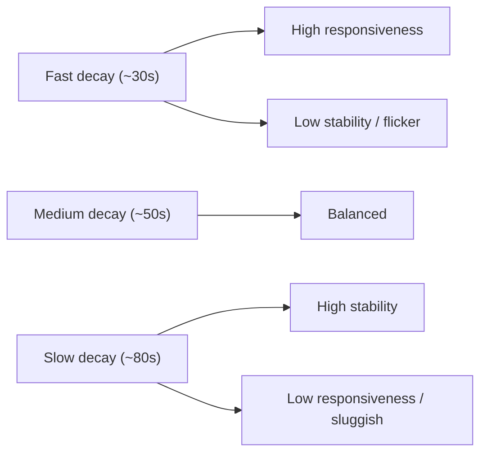

# 03 — Momentum Decay Research (Part 3)

Decay is treated here as a **first-class component**, not a side-effect. In FlySense, decay is what makes momentum *feel* like momentum: it is the implementation of inertia (dimension 8 in [02-momentum-science.md](./02-momentum-science.md)) and simultaneously the system's anti-flicker / hysteresis layer (comment at L1738-1739 of [index.html](../../index.html)).

The central question:

> How long should momentum remain relevant if nothing else happens?

---

## Current behaviour (baseline)

```
dt    = clamp(secondsSinceLastPoll, 0, 120)
decay = 0.5 ^ (dt / 49)          // MOM_HALFLIFE_SEC = 49
mom   = prev * decay + gain
```

- **Model:** pure exponential, wall-clock based.
- **Half-life:** 49 seconds, **global** (identical for every sport and every state).
- **Strengths:** smooth, poll-rate independent, never snaps, single tunable dial.
- **Weakness:** one global curve cannot match the fact that a soccer goal stays relevant for minutes while an NBA possession turns over in seconds; and a flurry decays at the same rate as a sustained 5-minute run.

---

## Decay model comparison

### 1. Fixed decay (per-poll constant)

`mom = prev * k` each poll (e.g. `k = 0.8`).

- Simple, but **poll-rate dependent** — faster polling cools faster. This is exactly the bug the current wall-clock model was written to avoid (comment L1741-1743).
- **Verdict:** rejected. Regression from current.

### 2. Linear decay

`mom = max(0, prev - r*dt)`.

- Constant subtraction per second. Predictable "countdown" feel.
- Problem: high momentum and low momentum decay at the same absolute rate, so big runs die abruptly near the end and small runs linger oddly. Does not match perception (perception is roughly proportional — you lose a *fraction* of the feeling per unit time).
- **Verdict:** rejected as primary; useful only as a *floor sweep* near zero to avoid long dim tails.

### 3. Exponential decay (current)

`mom = prev * 0.5^(dt/halflife)`.

- Proportional, smooth, memoryless. Matches the "still-got-it then gradually less" intuition well.
- **Verdict:** keep as the **base model**. Everything below modifies its *half-life*, not its shape.

### 4. Dynamic decay (state/persistence-modulated half-life)

Half-life is not constant — it scales with how established the run is:

```
halflife_eff = baseHalflife(sport) * persistenceFactor * stateFactor
```

- `persistenceFactor` grows with run duration (dimension 5): a 4-minute run cools slower than a 20-second flurry. Bounded (e.g. 1.0 -> 1.8).
- This directly implements the inertia-modulated-by-persistence insight from Part 2.
- **Verdict:** recommended. This is the single biggest perceptual upgrade available from decay alone.

### 5. Sport-specific decay

`baseHalflife` differs per sport (table below). A hockey goal and a soccer goal should not fade on the same clock.

- **Verdict:** recommended. Cheap, high-impact, requires only a per-sport constant alongside the existing `bigPlay`/`cbMin` in `FLY_TUNING`.

### 6. State-specific decay

Different states cool differently:

- **On fire** should cool *slowly* once earned (a dominant run does not evaporate in one quiet possession) — protects against flicker at the top.
- **Warming** should cool *quickly* (an unconfirmed run should not linger and mislead).
- **Comeback** should hold its colour through the swing then release.
- **Verdict:** recommended as a light touch via `stateFactor` (e.g. onfire 1.3x, warming 0.8x). Keep the multipliers gentle to avoid surprising users.

---

## Recommended composite decay model

```
halflife_eff = baseHalflife(sport)
             * clamp(1 + persistenceGain * runDurationNorm, 1.0, 1.8)   // dynamic
             * stateFactor(currentState)                                 // state-specific
mom = prev * 0.5 ^ (dt / halflife_eff) + gain
```

Plus a near-zero **linear floor sweep** (subtract a tiny constant below mom≈5) so colours fully clear instead of leaving a perpetual dim tail.

This keeps the exponential backbone (so nothing snaps and poll-rate independence is preserved) while making cooling sport-aware, run-aware and state-aware.

---

## Momentum half-life by sport (proposed starting points)

Half-life = seconds for momentum to fall to 50% with no further scoring. Derived from each sport's scoring cadence and how long a score "feels" relevant (cross-referenced in [10-sport-specific.md](./10-sport-specific.md)). Current global value is **49s** for all.

| Sport | `sportKey` | Typical gap between scores | Proposed base half-life | Rationale |
|---|---|---|---|---|
| Soccer | `soccer` | very long (minutes) | **90s** | One goal dominates the narrative for minutes; rare events should linger. |
| Hockey | `hockey` | long | **70s** | Goals are scarce and momentum-defining. |
| Baseball | `baseball` | long, inning-paced | **75s** | Scoring clustered by inning; runs stay relevant across at-bats. |
| AFL | `australian-football` | medium | **55s** | Frequent goals but flowing; runs build over minutes. |
| NRL / Rugby | `rugby-league`, `rugby` | medium | **55s** | Tries are big and spaced; sets sustain pressure. |
| NFL | `football` | medium (drive-paced) | **50s** | Scores are big but drives take time; ~current. |
| NBA / basketball | `basketball` | short | **40s** | Constant scoring; runs are real but turn over fast. |

These are **hypotheses to be validated** (see decay validation below and [11-historical-validation-framework.md](./11-historical-validation-framework.md)), not final values. They are intentionally clustered near the current 49s so the change is an evolution, not a shock.

---

## Decay validation method

For each candidate half-life regime (Fast ≈ 30s, Medium ≈ 50s, Slow ≈ 80s), measure three properties against replayed historical matches ([11](./11-historical-validation-framework.md)) and a perception panel ([12](./12-user-perception-testing.md)):

| Property | What it measures | How |
|---|---|---|
| **User perception** | Does the colour match what a viewer feels at that moment? | Panel agreement score vs FlySense state at sampled timestamps. |
| **Stability** | Does the colour flicker / oscillate? | Count of state changes per minute; variance of momentum. Lower is calmer. |
| **Responsiveness** | How fast does a real run get recognised? | Median seconds from run start to correct state. Lower is snappier. |

**Expected trade-off curve:**



The dynamic+state-specific model is precisely the attempt to **break this trade-off**: be responsive when a run is new (short effective half-life early) and stable once a run is established (longer effective half-life later), rather than picking one global compromise.

---

## Recommendation summary

1. **Keep exponential** as the decay shape.
2. **Add per-sport `baseHalflife`** to `FLY_TUNING` (table above).
3. **Modulate half-life by persistence** (dynamic decay) — the key responsiveness/stability unlock.
4. **Add gentle state factors** (onfire slower, warming faster).
5. **Add a near-zero linear floor sweep** so colours fully clear.
6. **Validate** Fast/Medium/Slow regimes before locking the per-sport numbers.
