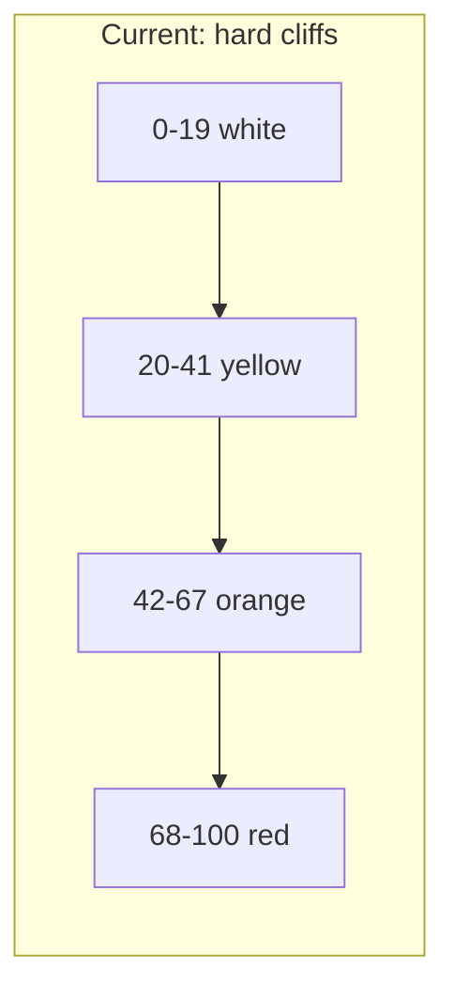
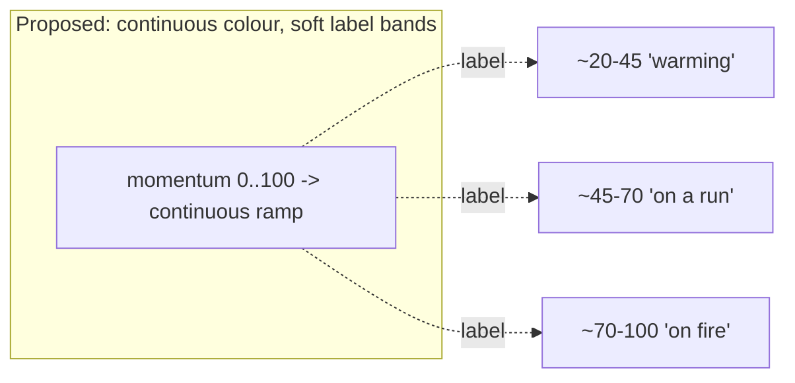

# 04 — Threshold Research (Part 4)

The current thresholds (`momTier`, L1788 of [index.html](../../index.html)):

```
onfire   >= 68
onrun    >= 42
warming  >= 20
neutral   < 20
```

This document asks three questions: should thresholds be **fixed**, should they be **per-sport**, should they be **adaptive** — and addresses the **threshold cliff** problem the brief calls out.

---

## The cliff problem

The brief's example is exact:

> 67 = On Run, 68 = On Fire

Two matches one momentum-point apart render in **completely different colours** (orange vs red), while two matches 25 points apart (43 and 67) render **identically** (both orange). The engine computes a smooth 0-100 value and then throws ~96% of its resolution away by bucketing into four states.



Consequences:
1. **Boundary flicker.** A side oscillating around 68 flips orange<->red repeatedly. Decay smooths the *value* but the *colour* still snaps at the boundary. (The 2.5s crossfade hides some of this but cannot remove it.)
2. **Wasted signal.** Real differences inside a band are invisible; trivial differences across a band are loud.
3. **Misleading equality.** A barely-warming side (20) and an almost-on-a-run side (41) look the same, implying a precision the colour does not have.

---

## Option A — Keep thresholds fixed (status quo)

- **Pro:** Simple, predictable, already shipped and understood.
- **Con:** All cliff problems above remain. Does not use the headroom.
- **Verdict:** baseline only.

## Option B — Per-sport thresholds

Should 68 mean "on fire" in soccer *and* basketball? Because momentum is already normalised by `bigPlay` per sport (L2339), the 0-100 scale is **roughly sport-neutral by construction** — a "full burst" maps to similar momentum regardless of sport. So per-sport *thresholds* are largely redundant with the per-sport `bigPlay` and per-sport decay already proposed in [03-decay-research.md](./03-decay-research.md).

- **Pro:** Could fine-tune for sports where bursts cluster differently.
- **Con:** Adds knobs that overlap with `bigPlay`/half-life; harder to reason about; risk of double-tuning the same effect.
- **Verdict:** Prefer to express sport differences through `bigPlay` + half-life (which feed the scalar), and keep the *mapping* sport-neutral. Revisit only if validation shows a specific sport's bursts systematically over/under-read.

## Option C — Adaptive thresholds

Thresholds shift based on game context (e.g. raise the "on fire" bar in a high-scoring shootout so everything is not red; lower it in a defensive grind).

- **Pro:** Keeps the colour distribution informative regardless of game flavour.
- **Con:** **Breaks cross-match comparability** — the same colour means different things in different games, violating "instantly understandable, no explanation". A user scanning a list of matches must be able to trust that redder = hotter everywhere.
- **Verdict:** **Reject for the displayed colour.** Adaptivity is appropriate for *internal normalisation* (already partly done via `bigPlay`) but not for the user-facing threshold. Consistency across the match list is a core FlySense promise.

---

## The recommended answer: dissolve the thresholds into a gradient

The cleanest resolution to the cliff problem is to stop quantising at all for the **colour** channel. Map momentum **continuously** to colour (see [05-gradient-system-design.md](./05-gradient-system-design.md)) so 67 and 68 are almost identical and 43 and 67 are visibly different — the inverse of today.

Thresholds then survive only as **soft state bands** used for *labels and semantics* (legend, accessibility text, comeback/cold logic), not for hard colour switches:



### Soft bands with hysteresis

Where a discrete label *is* needed (e.g. screen-reader text, the legend, deciding comeback eligibility), use **hysteresis** so the label does not chatter at a boundary:

```
enter 'onfire' at mom >= 70
exit  'onfire' at mom <  64        // 6-point dead-band
```

A symmetric dead-band around each boundary (enter high, exit low) eliminates boundary flicker for the label without affecting the smooth colour.

### Smoother transitions

The colour transition is already softened by:
- **Decay** at the data layer (momentum cannot jump) — L2338.
- **Crossfade** at the render layer (2.5s CSS transition) — L1760-1786, L181.

A continuous ramp adds a third, strongest smoother: there is no boundary to cross, so the transition is inherently soft everywhere.

---

## Recommendations

1. **Keep the 0-100 momentum scale sport-neutral**; express sport differences via `bigPlay` + half-life, not via thresholds.
2. **Replace hard colour cliffs with a continuous gradient** ([05](./05-gradient-system-design.md)).
3. **Retain thresholds only as soft, hysteretic label bands** for semantics/accessibility and for gating comeback/cold.
4. **Reject context-adaptive user-facing thresholds** — they break cross-match comparability.
5. Target band anchors (for labels only): warming ~20-45, on a run ~45-70, on fire ~70-100, with ~5-6 point dead-bands.
