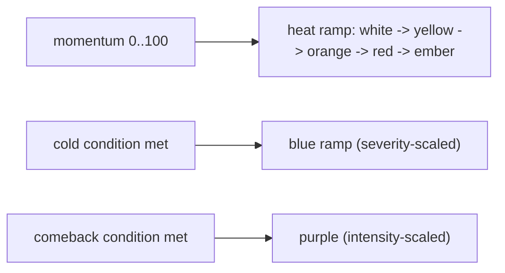

# 05 — Gradient System Design (Part 5)

**This is the preferred direction for FlySense 2.0.** Replace the four hard colour buckets ([04-threshold-research.md](./04-threshold-research.md)) with a continuous mapping from momentum (0-100) to colour, so the rich 0-100 signal the engine already computes becomes visible.

The current colour anchors (from `:root`, L26-30 of [index.html](../../index.html)):

```
--cold:      #409cff   (blue)
--upcoming:  #ffd60a   (yellow)   = warming
--onrun:     #ff9f0a   (orange)
--result:    #ff453a   (red)      = on fire
--comeback:  #bf5af2   (purple)
```

FlySense 2.0 keeps these as **anchor stops** on a continuous ramp rather than discrete switches.

---

## Colour intensity mapping

### The momentum ramp (neutral -> on fire)

Momentum 0-100 maps onto a single perceptual path that gets **hotter and more saturated** as momentum rises:

| Momentum | Colour | Perceived |
|---|---|---|
| 0-12 | white / neutral grey | nothing happening |
| 12-30 | white -> yellow | first stirrings |
| 30-50 | yellow `#ffd60a` -> orange `#ff9f0a` | warming into a run |
| 50-72 | orange -> red `#ff453a` | strong run |
| 72-90 | red, rising saturation/luminance | on fire |
| 90-100 | red -> deep ember red/white-hot | extreme (see [08](./08-visual-intensity.md)) |

Two visual variables move together along the ramp:
1. **Hue** slides white -> yellow -> orange -> red.
2. **Saturation + luminance** rise, so higher momentum is not just redder but *brighter and more vivid*. This is what makes 99 look hotter than 72 even though both are "red".

### Cold and comeback are off-ramp (semantic), not points on the heat scale

Blue (cold) and purple (comeback) are **not** low/high ends of the same scale — they are distinct semantic states. They branch off the heat ramp when their conditions are met:



- **Cold** gets its *own* intensity ramp (pale blue -> deep frozen blue) driven by cold severity ([07-cold-state.md](./07-cold-state.md)).
- **Comeback** gets purple at an intensity scaled by comeback magnitude ([06-comeback-system.md](./06-comeback-system.md)).

So FlySense 2.0 has **three ramps** (heat, cold, comeback), each continuous, selected by the same state priority as today (`comeback > heat > cold`), but rendered with intensity instead of a single flat colour.

### Implementation note (interpolation)

Compute the colour by interpolating between adjacent anchor stops:

```
t = (mom - stopLo) / (stopHi - stopLo)
colour = mix(colourLo, colourHi, smoothstep(t))
```

Interpolating in a perceptual space (OKLab/HSL-luminance) rather than raw sRGB avoids muddy mid-tones (e.g. the yellow->orange blend going brownish). The existing CSS variables stay as the anchor definitions, so the brand palette is unchanged — only the *in-between* is new.

---

## Transition behaviour

Three regimes, layered (two already exist today):

| Transition type | Where | Use in 2.0 |
|---|---|---|
| **Hard** | none | Avoid — this is the cliff problem we are removing. |
| **Soft (value)** | momentum decay (L2338) | Keep — momentum cannot jump, so colour cannot jump. |
| **Soft (render)** | `flyCrossfade` 2.5s CSS (L1760-1786) | Keep — but a continuous ramp means most frames only nudge colour slightly, so the crossfade becomes a gentle drift rather than a snap-and-fade. |
| **Animated (event)** | new, brief | Reserve a short emphasis (≤1s) for *events*: a swing/reversal ([02](./02-momentum-science.md) §7) or crossing into extreme ([08](./08-visual-intensity.md)). Not continuous motion. |

Principle: **continuous colour drift for state, brief motion for events only.** Constant animation would add clutter and battery cost and erode the premium feel.

---

## Accessibility

A momentum language that relies on colour must remain legible for everyone and in every environment. Validate four axes:

### 1. Colour blindness

- The heat ramp (yellow -> orange -> red) is **luminance-and-saturation-monotonic**, so even viewers who cannot separate the hues still read *intensity* (brighter/more vivid = hotter). This is the key safeguard: never rely on hue alone.
- **Blue (cold) vs red (on fire)** is safe for all common types (protan/deutan/tritan) because they differ strongly in both hue and luminance.
- **Risk pair: orange (on a run) vs red (on fire)** for protan/deutan. Mitigation: the continuous ramp already separates them by luminance; ensure the luminance gap across that segment is large enough to read without hue.
- **Risk pair: purple (comeback) vs blue (cold)** for tritan. Mitigation: comeback carries its own intensity behaviour and only appears near level scores; they rarely co-occur on the same card side.
- **Backstop:** the soft label bands ([04](./04-threshold-research.md)) provide a non-colour channel (text/legend/screen-reader) so colour is never the *only* carrier of meaning.

### 2. Low brightness (Fly Mode dimmed)

The current design deliberately uses **solid score-digit fills, not glows**, so the number stays readable at low brightness (comment L178-180). FlySense 2.0 must preserve this: the gradient applies to the **digit colour**, and any glow/ember effect ([08](./08-visual-intensity.md)) is **additive and optional**, never required to read the state. Verify the full ramp stays distinguishable at the lowest Fly Mode brightness.

### 3. Outdoor / high-glare viewing

- Maintain a minimum contrast ratio of the score against the dark card (`--card #111114`) across the *entire* ramp, including the pale low-momentum end (white-ish on near-black is safe; the risk is mid yellows washing out in glare — keep yellow luminance high).
- Avoid relying on subtle saturation differences that vanish in sunlight; the hue progression is the glare-robust channel.

### 4. Small screens

- Score digits are small; colour is read as a *fill*, which works at small sizes. Fine gradients *within* a single digit are invisible at phone scale, so the gradient is applied per-cell (whole score), not per-glyph.
- Effects ([08](./08-visual-intensity.md)) must scale down to a phone without becoming noise; reserve them for extremes only.
- App is width-capped at 430px (L35), so design and test at that width.

---

## What stays the same (preserve simplicity)

- Same five brand colours as anchors — no new hues to learn.
- Same state semantics and priority (`comeback > heat > cold`).
- Same "colour lives on the score digits" model.
- The legend ([01](./01-current-system-audit.md) §1, L1067-1077) still describes five readable states; the gradient just fills the space between them.

The user still learns "blue cold, yellow warming, orange running, red on fire, purple comeback" — the gradient makes those *more* accurate, not more numerous.

---

## Recommendations

1. Implement a **continuous heat ramp** (white -> yellow -> orange -> red -> ember) interpolated in perceptual colour space, with momentum driving both hue and luminance/saturation.
2. Give **cold** and **comeback** their own intensity-scaled ramps, selected by the existing state priority.
3. Keep the two existing soft transitions; add **brief event motion** only for swings and extreme crossings.
4. Enforce **luminance-monotonic** ramps so meaning survives colour blindness and glare.
5. Keep colour on the **score digits as solid fill**; treat glow/ember as optional additive layers ([08](./08-visual-intensity.md)).
6. Validate all four accessibility axes at 430px width and lowest Fly Mode brightness.
