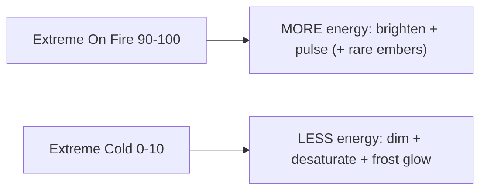

# 08 — Visual Intensity Research (Part 8)

**Colour remains primary. Visual effects are secondary.** This document asks whether effects (beyond colour) improve understanding, and specifies treatments for the two extremes — Extreme Cold (0-10) and Extreme On Fire (90-100) — within strict constraints.

Today the only effects are: a 1.6s opacity pulse on FlyTime scores (L188-189 of [index.html](../../index.html)) and a 600ms score-change flash (L2411-2423). Momentum states are pure solid colour.

---

## Do effects improve understanding?

Effects are justified only when colour alone has run out of expressiveness. Within a state, the gradient ([05](./05-gradient-system-design.md)) already encodes intensity through hue+luminance. So effects should add value **only at the extremes**, where:

- The user benefits from a *categorical* "this is exceptional" signal that a slightly-brighter-red cannot convey at a glance.
- The moment is rare enough that motion does not become ambient clutter.

**Conclusion:** Effects improve understanding **only for the top ~10% and bottom ~10% of momentum**, and only as a *reinforcement* of colour, never as the sole carrier. Everywhere else, colour + gradient is enough and effects would reduce clarity.

---

## Extreme On Fire (momentum 90-100)

Goal: convey "unstoppable, white-hot run" instantly, beyond "very red".

Candidate treatments, in order of preference (least to most intrusive):

| Effect | Description | Recommendation |
|---|---|---|
| **Pulse intensity** | Subtle brightness/scale pulse on the score, intensifying 90->100 | **Primary.** Reuses the existing `flyPulse` mechanism (L188); cheap, readable, premium. |
| **Heat shimmer** | Very slight, slow distortion/gradient shift behind the score | **Secondary.** Only if it stays subtle on small screens. |
| **Flame accents** | Small flame/ember licks at the score edge | **Use sparingly.** Risk of cartoon; only at 97-100. |
| **Embers** | A few drifting ember particles | **Optional, top of range only.** Highest clutter/perf cost. |

Principle: a **brightening pulse** is the safest, most legible "extreme" cue. Particle/flame effects are reserved for the very top (e.g. 97+) and must be small, sparse and slow.

---

## Extreme Cold (momentum 0-10, with collapse + drought + dominance — see [07](./07-cold-state.md))

Goal: convey "completely frozen, being run over".

| Effect | Description | Recommendation |
|---|---|---|
| **Cold glow** | Faint cool halo behind the (dimmed) score | **Primary.** Quietest possible cue; reads as "lifeless". |
| **Frozen score appearance** | Score desaturated toward icy white-blue, slightly dimmed | **Primary.** Pairs with the deep-blue ramp end. |
| **Ice edge treatment** | Subtle frosted edge/vignette on the score cell | **Secondary.** Keep faint. |
| **Frost** | Light frost texture creeping at cell corners | **Optional, extreme only.** Must not reduce digit contrast. |

Principle: cold effects should *reduce* visual energy (dim, desaturate, still) — the opposite of fire's *increase*. This asymmetry is itself informative: hot = alive/moving, cold = frozen/still.

---

## Visual constraints (non-negotiable)

Every effect must:

1. **Preserve readability.** The score number must remain the most legible thing on the card at all times, including at lowest Fly Mode brightness (the reason today's states use solid fills, not glows — comment L178-180). Effects are layered *behind/around* the digits, never *over* them.
2. **Preserve premium feel.** Subtle, slow, restrained. ScoreFly is a clean, dark, Apple-adjacent UI (L26-35). Effects should feel like quality lighting, not a game HUD.
3. **Avoid cartoon appearance.** No literal cartoon flames/snowflakes. Abstract heat/cold (glow, shimmer, desaturation) over literal iconography.
4. **Avoid visual clutter.** At most **one** effect active per score cell. Effects only at extremes, so a typical match list shows few or none.
5. **Scale to mobile.** Test at the 430px cap (L35). Anything invisible or noisy at phone size is cut. Respect `prefers-reduced-motion` (disable motion, keep colour). Cap particle/animation cost for battery and for many simultaneous live cards.

---

## Performance budget

The feed can render many live cards at once, each rebuilt every poll ([01](./01-current-system-audit.md) §11). Therefore:

- Prefer **CSS-only** effects (opacity/filter/transform) that the compositor can run cheaply — exactly what `flyPulse` already does.
- Avoid per-frame JS or canvas particles for the common case; if embers are used, cap count hard and only at 97+.
- Gate all motion behind `prefers-reduced-motion`; gate heavy effects behind extreme-state membership so 95% of cards pay nothing.

---

## Recommendations

1. Use effects **only** for Extreme On Fire (90-100) and Extreme Cold (0-10); colour+gradient carries everything else.
2. **Fire = add energy** (brightening pulse primary; shimmer/flame/embers escalating and rare). **Cold = remove energy** (dim, desaturate, faint frost glow).
3. Effects are **additive reinforcement**, never the sole signal; readability of the digit is paramount.
4. **One effect per cell max**, CSS-first, `prefers-reduced-motion` respected, tested at 430px.
5. Reuse the existing `flyPulse`/flash machinery where possible to keep it cheap and on-brand.
