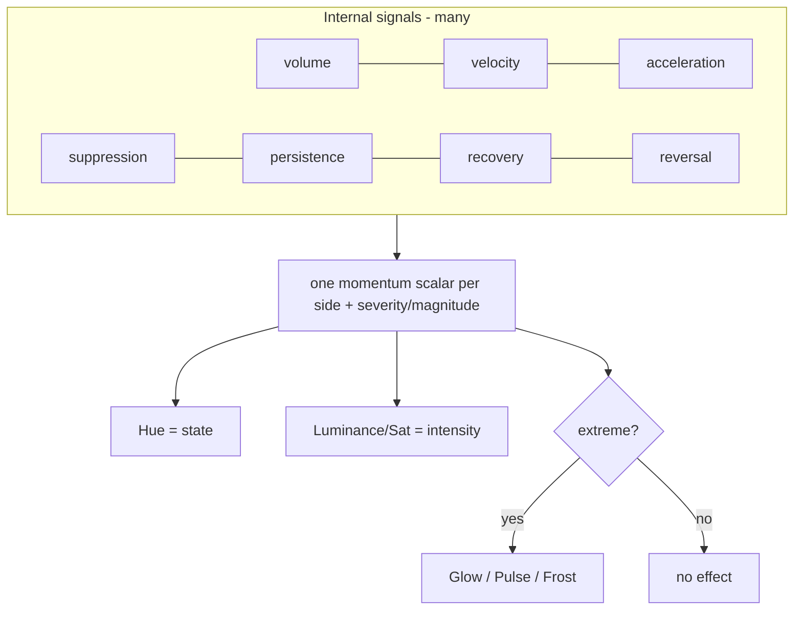

# 09 — Information Density Research (Part 9)

**Goal:** increase understanding without increasing the learning burden. The danger of FlySense 2.0 is obvious — more signals could mean more to learn. This document assigns each *visual channel* a single, intuitive job so the system says more while the user learns nothing new.

The governing rule:

> Every channel must map to a perception the user *already has*, so no legend study is required. Heat means hot. Brightness means stronger. Motion means dramatic. Stillness means dead.

---

## Available visual channels

| Channel | What it can encode | Learning burden |
|---|---|---|
| **Hue (colour)** | *Which* state (warming/run/fire vs cold vs comeback) | Already learned today |
| **Saturation/Luminance** | *How much* within a state (intensity) | None — "brighter = more" is innate |
| **Glow** | Extreme reinforcement | None — "glowing = intense" is innate |
| **Motion (pulse)** | Liveness / extreme event | None — "pulsing = alive/urgent" is innate |
| **Shading/gradient direction** | Could encode trend (rising/falling) | High — not intuitive, risk |

---

## Channel assignment for FlySense 2.0

The key design move: **map each channel to one perception, and do not overload.**

| Channel | Assigned meaning | Driven by |
|---|---|---|
| **Hue** | The state category | state priority: heat ramp / cold / comeback ([05](./05-gradient-system-design.md)) |
| **Saturation + Luminance** | Intensity *within* the state | momentum scalar / cold severity / comeback magnitude |
| **Glow** | "Extreme" flag | extreme membership only ([08](./08-visual-intensity.md)) |
| **Pulse (motion)** | Extreme fire liveness + brief swing events | extreme fire; reversal events ([02](./02-momentum-science.md) §7) |
| **Stillness/desaturation** | Extreme cold | extreme cold ([07](./07-cold-state.md)) |
| **Score-change flash** | "a score just happened" | unchanged (L2411-2423) |

What is deliberately **left unused**: gradient *direction* / shading to encode trend (rising vs falling momentum). It is tempting (acceleration is a real signal — [02](./02-momentum-science.md) §3) but there is no intuitive visual for "this colour is on its way up vs down", so encoding it would add learning burden. Instead, **acceleration is folded into the scalar** (it makes the colour change faster), so the user perceives the trend through *motion of the colour over time*, not a static cue. This is the crucial density trick: extra dimensions become *temporal behaviour* of existing channels rather than *new static channels*.

Many inputs, **few outputs**. The user only ever reads: colour (what), brightness (how much), and — rarely — an effect (exceptional). That is three perceptions, all innate, the same number they read today.

---

## Density without complexity: the principle

1. **Add resolution to existing channels, not new channels.** The gradient turns 4 colour buckets into a smooth scale — vastly more information, zero new concepts ([05](./05-gradient-system-design.md), [04](./04-threshold-research.md)).
2. **Push new dimensions inward.** Acceleration, recovery, persistence and suppression modulate the *scalar and its timing*, not the UI ([02](./02-momentum-science.md) recommendation). They make the colour *more accurate and more responsive*, which the user experiences as "it just feels right", not as new things to read.
3. **Reserve novelty for extremes.** Effects only appear at the top/bottom 10%, so they read as "this is special" rather than "here is another thing to interpret" ([08](./08-visual-intensity.md)).
4. **Keep the legend the same length.** Five states + FlyTime green, exactly as today (L1067-1077). The gradient and effects are *self-explanatory amplifiers* of those five, not additions to the legend.

---

## Recommendations

1. Lock a **one-channel-one-meaning** mapping: hue = state, luminance/saturation = intensity, effects = extreme flag.
2. **Do not** encode trend as a static visual; fold acceleration/recovery into the scalar so trend shows as colour *movement*.
3. Increase density purely by (a) gradient resolution and (b) extreme effects — both innate to read.
4. Keep the user-facing legend at its current size; 2.0 amplifies the existing five states rather than adding states.
