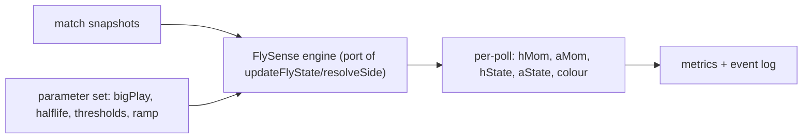

# 11 — Historical Validation Engine (Part 11)

**Status: designed, not executed.** This document specifies a runnable-later framework to validate FlySense outputs against thousands of historical matches. No dataset is wired into this deliverable; the design below is built to slot onto the **existing** FlyTime engine infrastructure.

> The ultimate test is perception ([12](./12-user-perception-testing.md)). This engine is the *quantitative* pre-filter: it lets us compare FlySense variants cheaply and at scale before putting any in front of users.

---

## Build on what already exists

The repo already has a Python platform that collects and stores ESPN match data — reuse it rather than building new ingestion:

| Existing asset | Role for FlySense validation |
|---|---|
| `flytime-engine/flytime_engine/collector.py` | ESPN polling/snapshot collection |
| `flytime-engine/flytime_engine/espn.py` | ESPN feed parsing |
| `flytime-engine/flytime_engine/db.py` | Match/snapshot storage |
| `main.py backfill --league X` | Backfills historical matches (already used for FlyTime — see [FlyTime-Intelligence README](../FlyTime-Intelligence/README.md)) |
| `replay_proxy_analysis.py`, `validate_flytime_rules.py` | Pattern for offline replay + rule tests to copy |

The crucial requirement FlySense adds: **time-series score snapshots** (score + timestamp at each poll), not just final results. FlySense momentum is a function of the *sequence* of score deltas, so the validation data must preserve the poll-by-poll progression.

---

## Data schema

For each match, a sequence of snapshots:

```
match:
  id, sportKey, league, date
  snapshots: [ { ts, homeScore, awayScore, period, clockRaw, isOT }, ... ]
  final: { homeScore, awayScore }
```

Source options (in preference order):
1. **Engine backfill** of ESPN play-by-play / scoring-plays endpoints -> reconstruct snapshot timeline (most accurate; scoring plays carry timestamps).
2. **Live snapshot capture** going forward via the collector `serve` loop (what FlyTime already does), accumulating real poll cadence.
3. **Synthetic resampling** from box-score scoring plays at a fixed cadence (e.g. 30-60s) to mimic the app's polling.

---

## The replay harness

A pure function port of the FlySense engine ([01](./01-current-system-audit.md)) so the *exact* in-app logic runs offline over snapshots:



Key design points:
- **Parameterised.** Every constant from `FLY_TUNING`, `MOM_GAIN`, `MOM_HALFLIFE_SEC`, `momTier` thresholds, and the proposed 2.0 additions ([03](./03-decay-research.md), [10](./10-sport-specific.md)) is an input, so "Current" and any "Alternative" config run through the same code.
- **Deterministic.** Wall-clock decay uses the snapshot timestamps, so replays are reproducible.
- **Variant runner.** Run N parameter sets over the same corpus and diff their outputs.

---

## What to measure

### A. Current vs alternative FlySense output (no labels needed)

Comparative, label-free metrics that flag *behavioural* differences between configs:

| Metric | Definition | What it catches |
|---|---|---|
| **State-change rate** | state transitions per minute per match | flicker / instability ([03](./03-decay-research.md)) |
| **Time-in-state distribution** | % of live time in each state | a config that is "always red" or "never fires" |
| **Recognition latency** | seconds from a defined run start (e.g. an X-0 burst) to correct hot state | responsiveness |
| **Boundary dwell** | time spent within ±2 of a threshold | cliff exposure ([04](./04-threshold-research.md)) |
| **Extreme rarity** | % of time in Extreme Fire/Cold | confirms extremes stay rare ([08](./08-visual-intensity.md)) |
| **Two-sided coherence** | how often one side is hot while the other is not cold | card coherence ([07](./07-cold-state.md)) |

### B. Human-perception alignment (needs labels)

Define "ground-truth runs" without a user panel using **objective run detection** on the score timeline (e.g. a side scores ≥ K unanswered within T, sport-scaled), then measure whether FlySense was in the matching hot/cold state during those windows:

| Metric | Definition |
|---|---|
| **Run recall** | % of objective runs during which FlySense showed the correct hot state |
| **Run precision** | % of FlySense hot periods that coincide with an objective run |
| **Cold recall/precision** | same for droughts vs cold state |
| **Comeback recall** | % of objective comebacks (big deficit erased) flagged purple, by magnitude tier ([06](./06-comeback-system.md)) |

This is a **proxy** for perception, not perception itself — the same caution the FlyTime work raised about proxies (see [FlyTime-Intelligence](../FlyTime-Intelligence/README.md) executive conclusion). Use it to *rank* configs, then confirm the top few with real users ([12](./12-user-perception-testing.md)).

---

## Experiment protocol

1. Assemble a corpus of ≥ a few thousand matches spanning all sports in [10](./10-sport-specific.md), with snapshot timelines.
2. Define the **Current** config (today's exact constants) as baseline.
3. Define **Alternative** configs: gradient + per-sport half-life, dynamic decay, cold severity, comeback intensity — one variable at a time, then combined.
4. Run all configs through the replay harness over the full corpus.
5. Compute Section A + B metrics per config, per sport.
6. Rank configs; shortlist 2-3 for perception testing.
7. Lock per-sport parameters ([10](./10-sport-specific.md)) from the winning config.

---

## Outputs

- A metrics table per config × sport (CSV/JSON, mirroring `engine-report-pilot.json` style).
- Flagged regressions (e.g. "config X triples NBA flicker").
- Recommended parameter set with evidence.

---

## Recommendations

1. **Reuse the FlyTime engine's collector/db/backfill**; add snapshot-timeline storage.
2. **Port the FlySense engine to a parameterised pure function** for offline replay.
3. Measure **label-free behaviour** (flicker, dwell, latency) and **proxy perception** (objective-run recall/precision).
4. Treat proxy metrics as a *ranking* tool only; confirm with users.
5. Use results to lock the per-sport tuning table before shipping 2.0.
