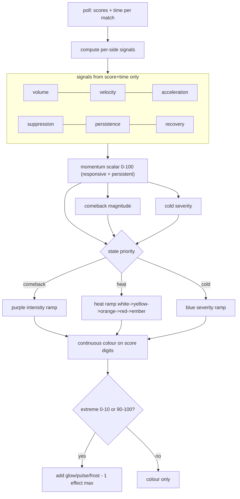
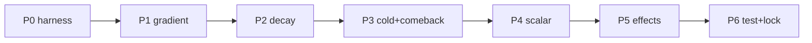

# 13 — FlySense 2.0 Consolidated Spec & Migration Path

This is the synthesis of Parts 1-12 into a single proposed model and a phased, low-risk migration that maps directly onto the existing functions in [index.html](../../index.html). It is a **specification for a future build phase**, not code shipped in this deliverable.

---

## 1. The model in one picture



**Backbone unchanged.** The momentum scalar and its exponential decay survive; everything else refines how the scalar is computed, mapped to colour, and reinforced at extremes.

---

## 2. Proposed engine changes (vs today)

| Area | Today | FlySense 2.0 | Source |
|---|---|---|---|
| Momentum scalar | decayed volume only | volume + **acceleration** + **recovery ember** | [02](./02-momentum-science.md) |
| Decay | global 49s exponential | **per-sport** half-life, **persistence-modulated**, gentle **state factors**, floor sweep | [03](./03-decay-research.md) |
| Thresholds | hard cliffs 20/42/68 | **continuous colour**; thresholds become **soft hysteretic label bands** | [04](./04-threshold-research.md) |
| Colour | 4 discrete classes | **continuous heat ramp** (hue + luminance) | [05](./05-gradient-system-design.md) |
| Cold | binary, relative | **severity ramp** + absolute-drought trigger + **Extreme Cold** | [07](./07-cold-state.md) |
| Comeback | binary | **magnitude-scaled** purple + intensity tiers | [06](./06-comeback-system.md) |
| Effects | FlyTime pulse only | **extreme-only** glow/pulse/frost, 1 per cell | [08](./08-visual-intensity.md) |
| Sport tuning | `bigPlay`, `cbMin` | + **`baseHalflife`**, **`droughtNorm`** | [10](./10-sport-specific.md) |
| Channels | hue only | hue=state, **luminance=intensity**, effect=extreme | [09](./09-information-density.md) |

---

## 3. Proposed computation (reference)

Per side, per poll (extends `updateFlyState` / `resolveSide`):

```
# signals over trailing window W (sport-scaled)
volume      = sum(myDelta, W) / bigPlay
velocity    = sum(myDelta, W) / W
accel       = velocity(recentHalf) - velocity(priorHalf)
suppression = sum(myDelta, W) / (sum(myDelta, W) + sum(oppDelta, W) + eps)
persistence = now - runStartTs
ember       = max(ember * slowDecay, recentPeakMom)     # recovery memory

# scalar (gain now boosted by acceleration + ember; capped as today)
gain        = min(myDelta / bigPlay, 1.6) * MOM_GAIN * (1 + kAcc*max(accel,0) + kEmber*ember)
halflife    = baseHalflife(sport) * clamp(1 + kP*persistenceNorm, 1.0, 1.8) * stateFactor
mom         = clamp(prevMom * 0.5^(dt/halflife) + gain, 0, 100)

# states (priority comeback > heat > cold), each with hysteresis
comebackMag = f(maxDef/cbMin, recoveryFrac, recoverySpeed, positionBonus)
coldSev     = combine(stallDepth, oppMom*suppression, droughtNorm, collapse)
state       = resolve(mom, comebackMag, coldSev)         # same priority order as L2356

# colour = continuous ramp for the chosen state's family, intensity from mom/coldSev/comebackMag
# effects only if mom>=90 (fire) or coldSev extreme (cold)
```

All constants (`kAcc`, `kEmber`, `kP`, `baseHalflife`, `droughtNorm`, ramp stops, hysteresis dead-bands) are **validation outputs** ([11](./11-historical-validation-framework.md)), not guesses to ship.

---

## 4. Migration path (phased, low-risk)

Each phase is independently shippable and reversible. Order is chosen so the **highest perceptual gain per unit risk** comes first.

### Phase 0 — Validation harness (no app change)
Port the engine to the replay harness ([11](./11-historical-validation-framework.md)); establish Current baseline metrics. Nothing user-facing.

### Phase 1 — Continuous gradient (biggest win, lowest logic risk)
Replace the 4 discrete `fs-*` colour classes with a continuous colour computed from the **existing** momentum scalar. No change to how momentum is calculated — only how `getFlyClass` -> colour works (L2374, L181-186). Keeps semantics identical; removes the cliff. This alone delivers most of the perceived improvement ([04](./04-threshold-research.md), [05](./05-gradient-system-design.md)).

### Phase 2 — Per-sport + dynamic decay
Add `baseHalflife`/`droughtNorm` to `FLY_TUNING` (L1727) and make `MOM_HALFLIFE_SEC` per-sport + persistence-modulated in `updateFlyState` (L2338). Improves responsiveness/stability balance ([03](./03-decay-research.md), [10](./10-sport-specific.md)).

### Phase 3 — Cold severity + comeback intensity
Upgrade `resolveSide` (L2357) to emit severity/magnitude alongside state; add the absolute-drought cold trigger; add hysteresis to all bands. Map to blue/purple intensity ramps ([06](./06-comeback-system.md), [07](./07-cold-state.md)).

### Phase 4 — Richer scalar (acceleration + recovery)
Add the `accel` and `ember` terms to the gain (L2339). Pure internal accuracy upgrade; no new UI ([02](./02-momentum-science.md)).

### Phase 5 — Extreme effects
Add Extreme On Fire / Extreme Cold treatments, CSS-first, `prefers-reduced-motion`, one per cell, extremes only ([08](./08-visual-intensity.md)).

### Phase 6 — Perception testing + lock
Run [12](./12-user-perception-testing.md) on the combined config; lock per-sport parameters; ship.



---

## 5. State container additions

`flyState[id]` ([01](./01-current-system-audit.md) §5) gains a few fields to support the above (all small, in-memory):

- `runStartTs` per side — for persistence.
- `peakDeficitTs` per side — for comeback speed ([06](./06-comeback-system.md)).
- `ember` per side — recovery memory ([02](./02-momentum-science.md) §6).
- `peakMom` per side — for collapse detection ([07](./07-cold-state.md)).

No persistence/localStorage change required; these rebuild live like the rest of `flyState`.

---

## 6. What does NOT change (guardrails)

- FlySense still answers only "what are the teams doing right now" — no quality/excitement/FlyTime-probability creep.
- FlyTime override stays (in FlyTime, both scores go green — L2375); FlySense remains a separate layer.
- Colour lives on the **score digits as solid fill**; effects are additive only.
- The legend stays five states + FlyTime green.
- Poll-rate independence (wall-clock decay) is preserved.

---

## 7. Success-criteria checklist (how 2.0 satisfies each)

| Criterion | How 2.0 meets it |
|---|---|
| Remain instantly understandable | Same 5-state colour language; gradient just sharpens it ([05](./05-gradient-system-design.md), [09](./09-information-density.md)) |
| Require no explanation | Channels map to innate perceptions; legend unchanged length ([09](./09-information-density.md)) |
| Better reflect human perception | 8 momentum dimensions folded into the scalar ([02](./02-momentum-science.md)) |
| Work across all sports | Single per-sport tuning table; sport-neutral mapping ([10](./10-sport-specific.md)) |
| Preserve ScoreFly simplicity | No new states, no new legend entries; internal-only complexity ([09](./09-information-density.md)) |
| Increase information density | Gradient resolution + extreme effects, both innate to read ([04](./04-threshold-research.md), [08](./08-visual-intensity.md)) |
| Improve momentum accuracy | Acceleration/recovery/suppression + per-sport decay ([02](./02-momentum-science.md), [03](./03-decay-research.md)) |
| Richer language, no added complexity | Same channels carrying more, validated by perception tests ([12](./12-user-perception-testing.md)) |

---

## 8. Open items / risks

- **Per-sport numbers are hypotheses** until [11](./11-historical-validation-framework.md) runs. Do not ship Phase 2 values unvalidated.
- **No play-by-play** — FlySense cannot see soccer/hockey pressure without goals; momentum is fundamentally score-driven. This bounds achievable accuracy and is acceptable (FlySense is a *score* momentum language).
- **Cricket** lacks a `FLY_TUNING` row (falls back to basketball) — decide whether to add one ([10](./10-sport-specific.md)).
- **Effect performance** with many live cards — gate hard behind extremes + `prefers-reduced-motion` ([08](./08-visual-intensity.md)).
- **Color-blind confusion pairs** (orange/red, purple/blue) — rely on luminance monotonicity; verify in [12](./12-user-perception-testing.md) Test 5.

---

## Final principle

> The best FlySense system is the one where a user looks at a match for one second and instinctively knows exactly what is happening.

FlySense 2.0 pursues this by making the *existing* signal honest (continuous colour instead of cliffs), the *existing* decay sport-true, and the *extremes* unmistakable — while adding **zero** new things for the user to learn.
