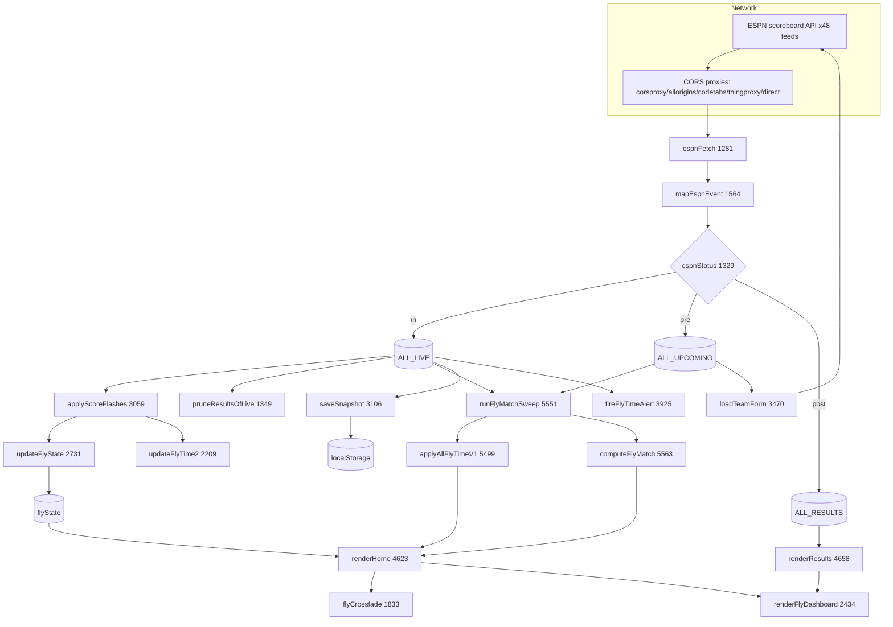

# Phase 1 - System Map

The app is one self-contained HTML file: ~1,110 lines of CSS in `<head>`, a small `<body>` shell, then ~5,140 lines of JS in a single `<script>` (starts `index.html:1113`, ends `index.html:6258`). There is no module boundary, so "systems" below are logical groupings of functions, not files.

All entry points are anchored to real functions. Line numbers are the workspace copy.

---

## 1. App shell / bootstrap

- **Purpose:** paint instantly, register the SW, wire tabs, kick the poll loop.
- **Entry:** the deferred root IIFE `setTimeout(()=>{...},0)` at `index.html:6210-6245`; SW registration at `6248-6257`.
- **Inputs:** `localStorage` (favs, onboarding flag, last tab, snapshot, caches), `location.hash`.
- **Outputs:** first paint via `hydrateSnapshot()` then `renderHome/renderResults/renderFavs`; starts `pollTick()`.
- **Dependencies:** snapshot, favourites, FlyV1 engines (`loadFlyV1Engines`), halo config (`loadTeamHaloConfig`).
- **Calculation chain:** `hydrateSnapshot -> applyInitialFilter -> loadTeamHaloConfig().then(bootUI) -> pollTick`.
- **Perf impact:** correctly defers `createElement` into `setTimeout(...,0)` per the hard rule.
- **Failure points:** all wrapped in try/catch; a corrupt snapshot just no-ops.
- **Simplification:** none needed; this part is clean.

## 2. Data flow / ingestion

- **Purpose:** turn 48 ESPN scoreboard feeds into `ALL_LIVE` / `ALL_UPCOMING` / `ALL_RESULTS`.
- **Entry:** `loadLiveData()` `index.html:3136` (full sweep), `refreshLiveFeeds()` `3229` (fast lane).
- **Inputs:** `ESPN_FEEDS` (`1144`), follow list (deep-window selection via `followedFeedSlugs` `1225`), date windows (`1139-1142`).
- **Outputs:** the three global arrays, `lastUpdateMs`, snapshot, then triggers render + form fetch.
- **Mapping:** `mapEspnEvent` `1564` -> per-status object; `espnStatus` `1329`; `espnTimer` `1357`.
- **Calculation chain:** `espnFetch -> mapEspnEvent -> push by espnStatus -> applyScoreFlashes -> swap arrays -> pruneResultsOfLive -> runFlyMatchSweep -> render -> saveSnapshot -> loadTeamForm`.
- **Perf impact:** full sweep fires 48 fetches via `Promise.allSettled`; fast lane only live feeds.
- **Failure points:** `coveredSports.size === 0` -> connection banner + retry; partial coverage silently keeps whatever returned.
- **Simplification:** the deep-window recompute (`followedFeedSlugs`) runs every full sweep though favs rarely change; could memoise on favs change. Low value.

## 3. Polling

- **Purpose:** refresh cadence proportional to how "live" things are, without overlapping loops.
- **Entry:** `pollTick()` `3286`, `scheduleNextPoll()` `3318`.
- **Tiers (actual):** `FLYMODE_POLL 1s` > `FLYTIME_POLL 3s` > `FAST_POLL 4s` > `SOON_POLL 30s` > `SLOW_POLL 60s`; `RETRY_POLL 8s` on failure; full sweep every `FULL_EVERY = 15` fast cycles (`1129-1135`, `3318-3328`).
- **Inputs:** `document.hidden`, `currentLiveFeeds()`, `anyFlyTimeLive()`, `anyStartingSoon()`, `isFlyModeActive()`.
- **Outputs:** schedules the next `setTimeout`; one timer (`pollTimer`), guarded by `isPolling`.
- **Perf impact:** the 1s Fly Mode tier is the most expensive cadence (full grid rebuild + crossfade every second).
- **Failure points:** `isPolling` guard prevents overlap; `document.hidden` skips work but still reschedules.
- **Doc drift:** `SCOREFLY.md` still says 12s; `config.py` says 12/8. **Flag.**
- **Simplification:** sound design. See Phase 5 for the 1s-tier cost.

## 4. Match lifecycle / classification

- **Purpose:** decide live / upcoming / finished, and keep a match out of two lists at once.
- **Entry:** `espnStatus(comp)` `1329` (trusts ESPN `status.type.state`), `pruneResultsOfLive()` `1349`, `detectOT` `1429`.
- **Inputs:** ESPN `status.type.state/name/completed`, event date.
- **Outputs:** a status string consumed by ingestion.
- **Accuracy:** v82 rewrite is correct and well-reasoned; fallback path is sane.
- **Failure points:** fast lane caps just-finished results at 7 days (`RESULTS_MS` `3233`) while the full sweep keeps 30; minor window inconsistency (Phase 6).

## 5. FlySense (momentum / state engine)

- **Purpose:** colour live score cells by what is happening (8 states + continuous gradient).
- **Entry:** `updateFlyState(m)` `2731`, `resolveSide(c)` `2857`, `updateCricketFly` `2930`, `momTier` `1873`, ramps `1888-1924`, `getFlyClass`/`getFlyStyle` `3029/3043`.
- **Inputs:** per-poll score deltas, clock/period, `FLY_TUNING` (`1747`), prior `flyState[id]`.
- **Outputs:** `flyState[id]` (momentum, tier, state, gradient colour, extreme flag, trailing `hist`).
- **Perf impact:** runs for every live match every poll, including a trailing-window loop over `hist` (`2773-2790`). See Phase 4.
- **Failure points:** purely derived from score+clock; no extra feed, so it degrades gracefully.
- **Simplification:** the richest subsystem; Phase 4 proposes trimming the scalar terms.

## 6. FlyTime (the clutch-moment detector + predictors)

- **Purpose:** is a live game in a close, late, clutch moment (green fly), and will an upcoming one be (yellow fly).
- **Entry (live):** `isFlyTime(m)` `1934`, `isFlyTimePinned` `1986`, `FLY_BLOWOUT_MARGIN` `1964`.
- **Entry (predict):** v1 `flyV1Score` `5440` + `FLY_V1_REGISTRY` `5353`; legacy `computeFlyMatch` `5563`; predictive `FLY2`/`updateFlyTime2` `2209`.
- **Inputs:** live clock/score; offline tables; per-team margins/records/form.
- **Outputs:** `getMatchFly()` (live), `m.isFlyMatch`/`m.flyMatchRating` (yellow), `flyState[id].ft2*` (likely).
- **Perf impact:** `runFlyMatchSweep` `5551` iterates LIVE + UPCOMING each poll, then `applyAllFlyTimeV1` iterates UPCOMING again (double pass, Phase 2/5).
- **Accuracy:** unvalidated end-to-end (Phase 3).
- **Simplification:** three layers should become one source of truth (Phase 3).

## 7. FlyScore (debug readout)

- **Purpose:** show the internal predictor score on every card for tuning.
- **Entry:** `flyScoreParts` `5625`, `flyScoreDebugHTML` `5664`, `fly2DebugHTML` `5698`; gated by `DEBUG_FLYSCORES = DEBUG_FLY` `2014`.
- **Cost:** in production today it renders on every card and can re-invoke `computeFlyMatch` mid-render (`5639`, `5653`). Should be off in production. **Phase 5/8.**

## 8. FlyMatch (yellow predictor sweep)

- **Purpose:** flag upcoming games likely to be close.
- **Entry:** `runFlyMatchSweep` `5551`, `computeFlyMatch` `5563`, helpers `fmCloseProfile`/`fmWinPct`/`fmFormScore`/`fmImportanceScore` `5298-5347`.
- **Inputs:** `m.homeMargins/awayMargins` (from form fetch), records, ranks, ESPN notes.
- **Outputs:** `m.isFlyMatch`, `m.flyMatchRating`; calls `ledgerPredict`.
- **Known issue:** margin data may not load (Phase 2/3).

## 9. FlyState storage / colour application

- **Purpose:** translate `flyState` into cell classes + inline gradient and animate transitions.
- **Entry:** `getFlyClass`/`getFlyStyle` `3029/3043`, `flyCrossfade` `1833`, `flyFadePrev` `1832`.
- **Cost:** `flyCrossfade` does a document-wide `querySelectorAll('[data-fk]')` + forced reflow each render; `flyFadePrev` grows unbounded (Phase 5/6).

## 10. Notifications

- **Purpose:** alert on team-live and FlyTime entry, with batching + cooldown.
- **Entry:** `fireMatchNotifications` `3758`, `fireFlyTimeAlert` `3925`, `flushFlyTimeAlerts` `3897`, `showFlyTimeNotification` `3874`, SW `notificationclick` (`sw.js:144`).
- **Inputs:** `favs` bells, `flyTimeAll` toggle, dedupe sets `flytimeAlerted`/`notifiedMatchIds`.
- **Limitation:** page-context `new Notification` / SW `showNotification`; no push subscription, so closed-app delivery is not guaranteed (Phase 7/8).
- **Minor bug:** FlyTime alert body is `${away} vs ${home}` (away-first, `3910`) - inconsistent with home-first elsewhere.

## 11. Team tracking / favourites

- **Purpose:** follow/manage teams; drive My Teams filtering, deep windows, alerts.
- **Entry:** `favs` (`4686`), `favMatchNames` `4598`, `teamMatch` `4612`, search index `buildSearchIndex` `4999`, `METRO_TEAMS`/onboarding suggestions.
- **Outputs:** filter sets used across Feed, Results, Fly Mode, notifications.
- **Inconsistency:** Feed uses substring `teamMatch` (`4627`), Fly Mode uses exact `favNames.includes` (`4840`). A team matched by substring in the Feed can be missing from Fly Mode. **Real bug (Phase 6).**

## 12. FlyMode

- **Purpose:** full-screen across-the-room live board (1-8 games).
- **Entry:** `enterFlyMode` `4927`, `buildFlyModeGrid` `4834`, brightness `4978`, fullscreen/wake-lock `4907-4943`.
- **Cost:** rebuilds the whole grid + `flyCrossfade` every 1s while open (the 1s tier).
- **Simplification:** grid markup is rebuilt wholesale; a keyed update would cut the 1s-tier cost (Phase 5).

## 13. Results

- **Purpose:** completed matches, grouped by date, My Teams/All.
- **Entry:** `renderResults` `4658`, `buildResultCard` `4537`.
- **Cost:** full `innerHTML` rebuild + a `renderFlyDashboard()` call every poll (`4681`).

## 14. Upcoming

- **Purpose:** future fixtures in the feed; drive yellow fly + form fetch.
- **Entry:** stored in `ALL_UPCOMING`, rendered by `buildUpcomingCard` `4516`; sorted by `eventMs`.
- **Cost:** `loadTeamForm` `3470` fetches per-team schedules for team sports; cached `scorefly_form_cache_v5` 6h TTL.

## 15. Historical (after-match stamp + ledger)

- **Purpose:** remember matches that reached FlyTime (red fly) and log predicted-vs-reached.
- **Entry:** `markFlyTimeMatch`/`matchHadFlyTime` `2004/2009`, ledger `ledgerPredict`/`ledgerAchieved`/`ledgerLikely` `2055/2078/2253`, prune to 35 days.
- **Limitation:** per-device, only stamps matches watched live; "reached" stuck at 0 (Phase 3).

## 16. Analytics (FlyTime Lab dashboard)

- **Purpose:** tuning dashboard (per-league yellow/green/blue/missed, margin coverage, engine health).
- **Entry:** `renderFlyDashboard` `2434`, `flyDashboardPerLeague` `2284`, `flyLedgerStats` `2266`.
- **Cost:** **runs every poll in production today** because `DEBUG_FLY=true` forces `flyLabEnabled()` true (`2024-2025`). Contains an O(45 x |UPCOMING|) loop (`2525-2531`). Should be lab-gated only (Phase 5/8).

---

## Data-flow diagram



## Poll hot-path diagram

```mermaid
flowchart TD
  PT[pollTick 3286] --> HID{document.hidden?}
  HID -->|yes| SCH
  HID -->|no| LF{currentLiveFeeds == 0\nOR fastCycles >= 15?}
  LF -->|yes| FULL[loadLiveData: 48 fetches]
  LF -->|no| FAST[refreshLiveFeeds: live feeds only]
  FULL --> REND
  FAST --> REND
  subgraph REND[Per-poll render work]
    R1[applyScoreFlashes -> updateFlyState + updateFlyTime2 per live match]
    R2[runFlyMatchSweep -> LIVE+UPCOMING, then applyAllFlyTimeV1 -> UPCOMING again]
    R3[renderHome: innerHTML rebuild of live+upcoming cards]
    R4[renderResults: innerHTML rebuild grouped by date]
    R5[flyCrossfade: querySelectorAll '[data-fk]' + forced reflow]
    R6[renderFlyDashboard: O 45 x UPCOMING loop  -- only because DEBUG_FLY=true]
    R7[per recreated logo img: attachTeamHaloProbe -> 32x32 canvas getImageData]
  end
  REND --> SCH[scheduleNextPoll 3318]
  SCH --> DLY{tier}
  DLY -->|FlyMode open| D1[1s]
  DLY -->|FlyTime live| D2[3s]
  DLY -->|live| D3[4s]
  DLY -->|soon| D4[30s]
  DLY -->|idle| D5[60s]
  D1 --> PT
  D2 --> PT
  D3 --> PT
```

---

## Cross-cutting observations

- **Three independent "fly" systems are correctly kept separate** per the locked spec: score-colour fill (FlySense), status borders, and the corner fly icon. The audit does not propose merging them.
- **The hot path does a lot of redundant full-array work** (rebuild + crossfade + dashboard + sweep) every poll, scaling with total games on the board, not just changed cells. This is the theme of Phase 5.
- **The predictor stack has accreted three layers** with overlapping intent. This is the theme of Phase 3.
