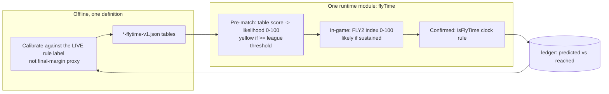

# Phase 3 - FlyTime Audit

FlyTime is the product's signature claim: *"We'll tell you when it matters."* This phase audits whether that claim is actually delivered, and proposes a redesign.

---

## 3.1 The three layers as they stand

| Layer | Fly colour | Trigger | Where |
|-------|-----------|---------|-------|
| **v1 offline tables** | yellow (upcoming) | `flyV1Score >= threshold` | `FLY_V1_REGISTRY` `index.html:5353`, `flyV1Score` `5440` |
| **Legacy `computeFlyMatch`** | yellow (upcoming, non-v1 sports only) | `flyMatchRating >= 62/82` | `5563` |
| **FlyTime 2.0 "Likely" (`FLY2`)** | flashing green (live, pre-confirmed) | `ft2Index >= enter`, sustained 16s | `FLY2` `2107`, `updateFlyTime2` `2209`, `flyTimeLikely` `2246` |
| **Confirmed live** | solid green | `isFlyTime(m)` true | `isFlyTime` `1934`, `isFlyTimePinned` `1986` |
| **After-match** | red | `matchHadFlyTime(id)` | `2004/2009` |

**Finding 3.1:** the doc (`SCOREFLY.md`) describes only v1 + legacy + confirmed/red. The **FLY2 "Likely" flashing-green fly is live in the code** (`flyTimeIcon` returns `ft-likely` at `5717-5718`) but is undocumented. So users may already be seeing a flashing green fly the spec does not mention, and it is gated on the same unproven `isFlyTimePinned` (via `confirmed` in `updateFlyTime2:2212`). **Impact 6 / Effort 2 / Risk 3** to either document or disable FLY2 until the base detector is proven.

---

## 3.2 The central reliability problem

**The red-fly / "reached" count has reportedly always been 0** (`SCOREFLY.md` ledger section, confirmed by code structure). Everything downstream of "a live game entered FlyTime" fires from one place:

```js
// index.html:2743
if(isFlyTime(m)){ markFlyTimeMatch(id); ledgerAchieved(m); }
```

`isFlyTime` (`1934`) needs `m.period`, `m.clockSec`, `m.hInt`, `m.aInt` - all populated by `mapEspnEvent` for live matches (`1639-1651`). So the wiring is correct. The most likely causes, in order:

1. **iOS suspends backgrounded web apps.** The app only polls while open and visible (`pollTick` early-returns on `document.hidden`, `3288`). A close finish watched with the phone locked or the app backgrounded produces no poll at the decisive minute, so `isFlyTime` is never evaluated then. The dashboard even says this (`2493`).
2. **Detection requires the app open during the final ~5 minutes** of a game, which is a narrow window few sessions hit.
3. **It has genuinely never been observed**, so there is no evidence the thresholds are even right.

**Consequence:** the yellow predictor cannot be validated. The ledger's precision/recall (`renderFlyDashboard:2450-2451`) are computed against an "achieved" count that is structurally near-zero, so **every yellow looks like a false alarm** and threshold tuning is blind. This is stated plainly in the code (`2492-2494`).

**Impact 10 / Effort 4 / Risk 2.** This is the single most important product finding. Until it is resolved, the entire FlyTime predictor stack is unmeasurable.

---

## 3.3 Calibration ground-truth mismatch

The offline calibration optimises thresholds so that roughly the top X% / ~2 close games per chunk qualify, where "close" is judged by **final margin**:

```python
# flytime.py:197-203
def retroactive_flytime_from_final(home_score, away_score, close_margin):
    return abs(home_score - away_score) <= close_margin
```

`percentile_threshold` (`flytime.py:206`) and `THRESHOLD_CANDIDATES` (`config.py:64`) pick the cutoff against that final-margin label.

But the **live** app does not use final margin - it uses a *clock+margin* rule (`isFlyTime`, `1934`): a game can finish within `close_margin` yet never have been close *late* (e.g. led the whole way, opponent scored a meaningless late goal), and a game can be a genuine clutch finish yet end outside `close_margin` (a late go-ahead score that stretches the final margin). 

**So the predictor is trained to predict "final margin small" while the app rewards "close and late".** These correlate but are not the same label. Even once detection works (3.2), the predictor is optimised for the wrong target.

**Impact 7 / Effort 6 / Risk 4.** Align the calibration label with the live rule.

---

## 3.4 Qualification / trigger / locking logic

- **Qualify (yellow):** `applyAllFlyTimeV1` / `computeFlyMatch` set `m.isFlyMatch` each sweep (`5499`, `5609`). Correct, idempotent.
- **Trigger (green):** `isFlyTime` evaluated in `updateFlyState` per poll (`2742-2743`).
- **Lock:** `isFlyTimePinned` (`1986`) keeps a match "in FlyTime" once `matchHadFlyTime(id)` is set, until blowout (`isFlyTimeBlowout` `1979`) or it leaves `ALL_LIVE`. Sound - prevents flicker when a game dips in and out of the margin.
- **Red:** `matchHadFlyTime` persists to `scorefly_flytime_matches`, 35-day prune (`1997-2008`). Per-device only.

**Finding 3.4:** locking and blowout-unpin are well designed; no change. The weakness is entirely upstream (detection never fires).

---

## 3.5 League + sport behaviour

- 45 feeds use v1 tables; cricket uses live rules only and gets **no yellow fly** (no `CLOSE_MARGIN` for cricket, Phase 2.4). Tennis is excluded everywhere.
- Per-league thresholds span 70 (CFL/NBL) to 98 (Championship/Argentina) (`5353-5398`). Wide spread is expected (different leagues have different close-game base rates) but, per 3.2/3.3, **none of these numbers has been validated against live outcomes**.
- AFL/NRL name normalisation for table lookup (`AFL_RESEARCH_NAMES` `5401`, `mapResearchTeam` `5416`) is a second place AFL names are mapped (the first is `AFL_TEAMS` `1450`); divergence between the two maps would silently drop a team from its v1 table (returns `null` -> no yellow). Worth a sync check.

---

## 3.6 Confidence

There are two distinct "confidence" notions and they are not connected:
- **FlySense confidence** (`flyGainAndConfidence` `2685`): lowers momentum trust after stale polls. Good.
- **FlyTime confidence:** there is none on the yellow prediction - `isFlyMatch` is a hard boolean at the threshold (`5494`, `5511`). FLY2 adds an EMA-smoothed *index* with hysteresis + 16s sustain (`updateFlyTime2:2225-2236`) which is the closest thing to graded confidence, but it is live-only and undocumented.

**Suggested improvement:** if FLY2 stays, it is the natural home for a single graded "FlyTime likelihood" 0-100 that unifies pre-match (yellow) and in-game (likely/green). See redesign.

---

## 3.7 Earlier prediction / simplification / accuracy-vs-compute

- **Earlier prediction** already exists via FLY2's "Likely" stage (flashing green before Confirmed). It is the right idea but unvalidated and undocumented.
- **Compute:** the predictor stack costs a double UPCOMING pass per sweep (Phase 2.8) plus per-poll `updateFlyTime2` for every live match. The FLY2 math is light; the waste is in the sweep structure, not FLY2 itself.

---

## 3.8 Redesigned FlyTime architecture (option)

A single source of truth, layered by *time to event*, not by *historical accretion*:



**Concrete moves (all single-file-safe):**

1. **Prove detection first (3.2).** Add a one-shot, opt-in foreground heartbeat that logs every `isFlyTime` evaluation for live matches to the ledger (even when false), so a single watched close finish produces evidence. This is a logging change, not an architecture change. *Impact 10 / Effort 3 / Risk 1.*
2. **Unify the three layers into one `flyTime(m)`** returning `{ stage: 'none'|'yellow'|'likely'|'confirmed'|'red', score: 0-100 }`. v1/legacy become the pre-match score source; FLY2 becomes the in-game score; `isFlyTime` is the confirmed gate. Callers (`flyTimeIcon`, alerts, pins) read one function. *Impact 6 / Effort 6 / Risk 5.*
3. **Single threshold source.** Keep thresholds only in `FLY_V1_REGISTRY` (runtime) and assert `config.py` matches via the offline sync check (Phase 2.11). *Impact 4 / Effort 3 / Risk 1.*
4. **Re-label calibration** to the live rule (`is_flytime_live` on the last-N polls of historical play-by-play if available, else the closest clock-based proxy ESPN exposes). *Impact 7 / Effort 7 / Risk 4.*
5. **Decide FLY2's fate now:** document it as a shipped feature or disable the `ft-likely` branch (`5717`) until base detection is proven. Shipping an undocumented flashing fly that depends on an unproven gate is the riskiest current state. *Impact 6 / Effort 2 / Risk 3.*

**Challenge against "Simple":** moving to one `flyTime(m)` *reduces* surface area (three concepts -> one staged score) and removes the doc/code gap - it serves "Simple". It must not add any new card UI (locked fly-icon spec) - the redesign is internal only; the fly icon language is unchanged.

---

## Phase 3 summary

| # | Finding | Impact | Effort | Risk |
|---|---------|:--:|:--:|:--:|
| 3.2 | Detection never confirmed live; whole predictor unmeasurable | 10 | 4 | 2 |
| 3.8.1 | Add foreground detection-heartbeat logging (prove it) | 10 | 3 | 1 |
| 3.3 | Calibration label (final margin) != live rule (close+late) | 7 | 6 | 4 |
| 3.1/3.8.5 | Undocumented FLY2 "likely" flashing fly; document or disable | 6 | 2 | 3 |
| 3.8.2 | Collapse 3 layers into one staged `flyTime(m)` | 6 | 6 | 5 |
| 3.5 | Cricket gets no yellow; AFL name map duplicated | 4 | 3 | 3 |
| 3.6 | No graded confidence on yellow | 3 | 4 | 4 |
